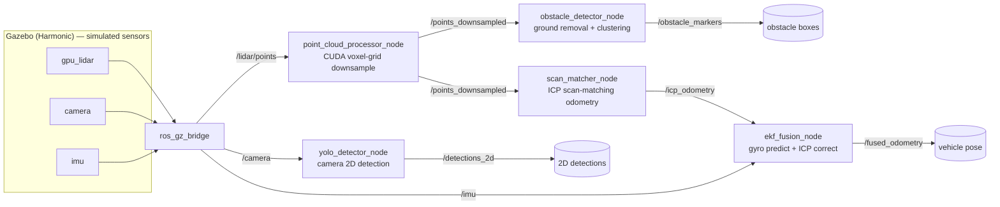

# av-perception-slam-stack

C++17 / CUDA / ROS2 perception + localization stack for a ground vehicle:
LiDAR point clouds and camera frames in, obstacle detections and a fused
pose estimate out — simulated end to end in Gazebo.

This is a companion project to
[friction-aware-planner](https://github.com/kaipowei/friction-aware-planner)
(motion planning + friction-aware speed control). That project explicitly
scoped **out** perception and SLAM to stay focused on its own thesis
(friction-limited planning) — its own `ROADMAP.md` says so directly:
*"Explicitly out of scope: Full SLAM (localization is assumed known)."*
This project exists to build the piece that assumption skipped over: the
sensing and localization layer a full autonomy stack needs alongside
planning and control. No code dependency between the two repos; the plan
is to consume `friction-aware-planner` as a pip dependency once this
project's pose output is ready to feed its planner, not to fork or vendor
its code.

Built specifically to close a resume gap: production C++ and CUDA
experience, and SLAM/localization/mapping — all explicitly called out as
requirements in robotics-software and AV-engineer internship postings
(NVIDIA's AV & Robotics internship among them) but not backed by any prior
project.

See [docs/learning-log.md](docs/learning-log.md) for a plain-language,
step-by-step record of what was built, why, and what it produced — written
to double as interview prep material.

## Architecture



Three ROS2 packages, each a separate concern:

| Package | Language | Responsibility |
|---|---|---|
| `fa_perception_cpp` | C++17 / CUDA | point-cloud downsampling, ground segmentation, clustering |
| `fa_perception_py` | Python | camera-based 2D detection (YOLO) |
| `fa_localization_cpp` | C++17 | ICP scan-matching odometry, IMU/ICP EKF fusion |

## Status

- **Phase 1 — done.** CUDA voxel-grid downsampler (custom kernel, not a
  library call), correctness-checked against a CPU reference and
  benchmarked (GPU wins above ~100k points; loses below that to
  launch/transfer overhead).
- **Phase 2 — done.** Gazebo test world with simulated LiDAR + camera,
  ground segmentation + clustering, a YOLO camera detector, and a recorded
  rosbag dataset (116.5s / 3677 messages).
- **Phase 3 — in progress.** ICP scan-matching localization, verified
  against Gazebo ground truth at ~0.53m error over a ~42m loop (~1.3%).
  IMU + EKF fusion brings that down to ~0.44m (~1.04%) — the fused
  estimate measurably beats ICP alone, which is the actual point of
  fusion. Getting here took five real bugs, each found by testing a single
  known motion instead of debugging the full loop directly — see
  [docs/learning-log.md](docs/learning-log.md) sections 7-9 for the full
  story. Closing the loop into `friction-aware-planner`'s planner is still
  ahead.

Two real-sensor-data problems that never showed up with Phase 1's
synthetic point cloud — NaN "no-return" LiDAR points, and the vehicle
detecting its own chassis — are also covered in the learning log, along
with why the dev environment ended up as Ubuntu 24.04 + ROS2 Jazzy + CUDA
12.6 specifically (a bleeding-edge Ubuntu release turned out to be
incompatible with every current CUDA release's bundled headers).

## Requirements

- ROS2 Jazzy
- Gazebo Harmonic (`ros-jazzy-ros-gz`)
- PCL (Point Cloud Library) 1.12+
- CUDA toolkit 12.6 (for the GPU-accelerated processing nodes)
- colcon
- Python: `ultralytics`, `opencv-python`, `numpy<2` (pinned — see the
  learning log for the `cv_bridge` ABI conflict this avoids)
- Developed and run inside WSL2 Ubuntu 24.04 on Windows

## Quick start

```bash
# build
cd ros2_ws
colcon build --symlink-install --cmake-args -DCMAKE_BUILD_TYPE=Release
source install/setup.bash

# terminal 1 — simulator (headless; drop --headless-rendering for the GUI)
gz sim -s -r --headless-rendering ../sim/worlds/test_track.sdf

# terminal 2 — bridge Gazebo sensors into ROS2
ros2 run ros_gz_bridge parameter_bridge \
  /lidar/points@sensor_msgs/msg/PointCloud2[gz.msgs.PointCloudPacked \
  /camera@sensor_msgs/msg/Image[gz.msgs.Image \
  /imu@sensor_msgs/msg/Imu[gz.msgs.IMU

# terminal 3 — perception + localization pipeline
ros2 run fa_perception_cpp point_cloud_processor_node --ros-args -r points_raw:=/lidar/points
ros2 run fa_perception_cpp obstacle_detector_node
ros2 run fa_perception_py yolo_detector_node --ros-args -r camera:=/camera
ros2 run fa_localization_cpp scan_matcher_node
ros2 run fa_localization_cpp ekf_fusion_node

# terminal 4 — drive the vehicle around (no drivetrain yet — this sweeps
# a fixed loop via Gazebo's set_pose service) and watch it work
python3 ../sim/drive_loop.py test_track 0.3
ros2 topic echo /fused_odometry
```

## Repository layout

```
ros2_ws/src/
├── fa_perception_cpp/    # CUDA downsample, ground segmentation, clustering
├── fa_perception_py/     # YOLO camera detector
└── fa_localization_cpp/  # ICP odometry, EKF fusion
sim/
├── worlds/test_track.sdf # Gazebo world: walls, obstacles, vehicle + sensors
├── drive_loop.py         # scripted waypoint sweep (no drivetrain yet)
└── videos/                # camera/LiDAR sensor-view demo clips
docs/
└── learning-log.md       # the full build story, Context/Action/Result per step
```
