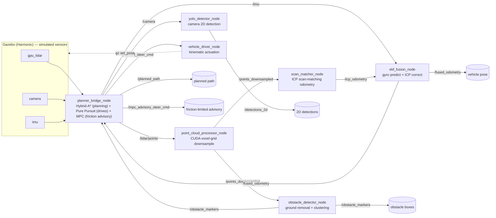
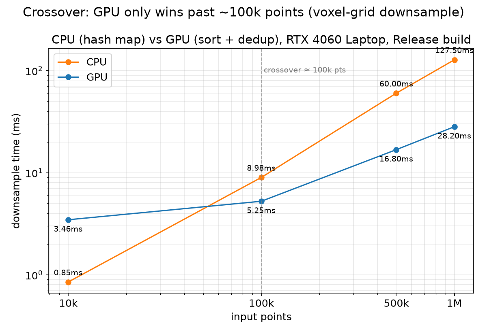
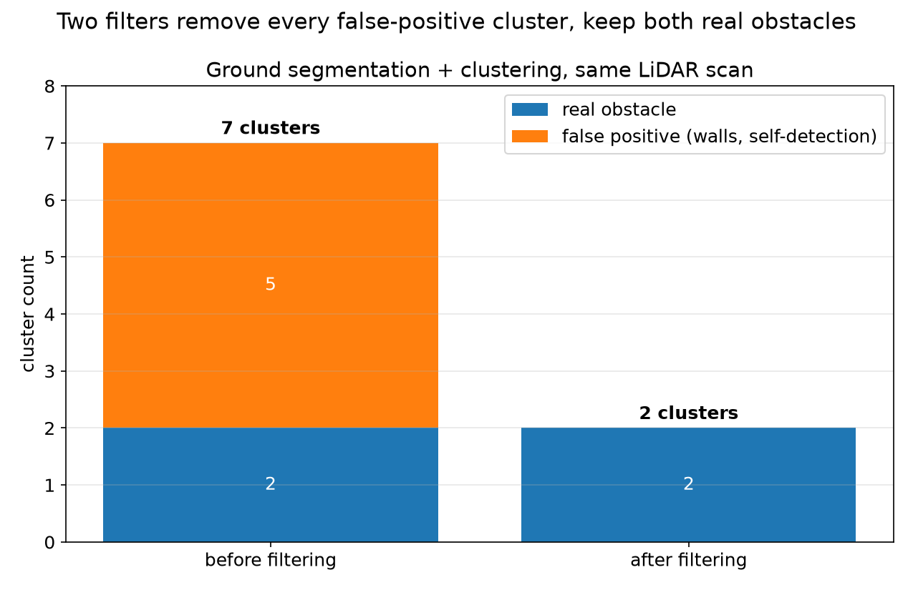
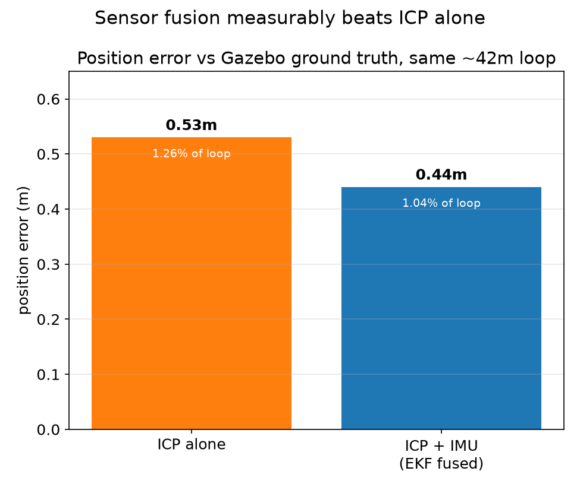

# av-perception-slam-stack

C++17 / CUDA / ROS2 perception + localization stack for a ground vehicle:
LiDAR point clouds and camera frames go in, obstacle detections and a
fused pose estimate come out — all simulated in Gazebo.

Companion project to
[friction-aware-planner](https://github.com/kaipowei/friction-aware-adaptive-motion-planner-ros2)
(motion planning + friction-aware speed control). That project deliberately
scoped perception and SLAM *out* to keep its own story tight — its
`ROADMAP.md` says it directly: "Explicitly out of scope: Full SLAM
(localization is assumed known)." This project is the piece that
assumption skipped over: the sensing and localization layer a full
autonomy stack actually needs alongside planning and control. No code
dependency between the two repos — `friction-aware-planner` is pulled in
as a pip dependency (its Hybrid-A* planner and MPC controller, unmodified),
not forked or copied.

Built to close a specific resume gap: production C++ and CUDA experience,
and SLAM/localization/mapping, all things robotics-software and
AV-engineer internship postings ask for (NVIDIA's AV & Robotics internship
included) that I didn't have a project backing up.

[docs/learning-log.md](docs/learning-log.md) has the full step-by-step
record of what got built, why, and what came out of it — written to
double as interview prep.

## Architecture



Three ROS2 packages, split by concern:

| Package | Language | Does |
|---|---|---|
| `fa_perception_cpp` | C++17 / CUDA | point-cloud downsampling, ground segmentation, clustering |
| `fa_perception_py` | Python | camera 2D detection (YOLO) |
| `fa_localization_cpp` | C++17 | ICP scan-matching odometry, IMU/ICP EKF fusion |
| `fa_bridge_py` | Python | plans with Hybrid-A*, drives with Pure Pursuit, runs MPC as a friction-aware advisory, actuates via a kinematic model |

## Results

Three numbers pulled straight out of `docs/learning-log.md`, not written for
this README — plain matplotlib, no styling pass.

**GPU only wins past ~100k points.** Same voxel-grid bucketing rule, one CPU
implementation, one GPU one (entry 4) — below the crossover the GPU's
kernel-launch and memory-transfer overhead costs more than the compute
saves, so the CPU reference actually wins there. Above it the GPU pulls
ahead, up to 4.5x by a million points.



**Ground segmentation + clustering catches every false positive without
touching the real obstacles.** Raw clustering on a real LiDAR scan flagged 7
objects, not 2 (entry 6) — four wall slivers and the vehicle detecting its
own chassis, on top of the two real boxes. Two filters (drop points inside
the sensor's min-range, drop clusters wider than a real obstacle) remove
all five false positives without touching either real detection.



**Fusing IMU with ICP beats ICP alone.** Checked against Gazebo's own
ground truth over the same ~42m loop (entry 12): ICP alone lands 0.53m off
(~1.3% of the loop), fusing gyro-predicted heading between ICP updates
brings that to 0.44m (~1.0%). Not a symmetry exercise — the fused estimate
is measurably better, which is the actual point of doing fusion at all.



## Status

- **Phase 1 — done.** CUDA voxel-grid downsampler, hand-written kernel not
  a library call, checked against a CPU reference and benchmarked (GPU
  wins past ~100k points, loses below that to launch/transfer overhead).
- **Phase 2 — done.** Gazebo test world with simulated LiDAR + camera,
  ground segmentation + clustering, a YOLO camera detector, and a recorded
  rosbag dataset (116.5s / 3677 messages).
- **Phase 3 — done.** ICP scan-matching localization, checked
  against Gazebo ground truth at ~0.53m error over a ~42m loop (~1.3%).
  IMU + EKF fusion brings that to ~0.44m (~1.04%) — the fused estimate
  measurably beats ICP alone, which is the actual point of doing fusion at
  all. Took five real bugs to get there, each one found by testing a
  single known motion instead of debugging the full loop directly — see
  [docs/learning-log.md](docs/learning-log.md) entries 10-12 for the whole
  story. `fa_bridge_py`'s `planner_bridge_node` closes the loop into
  `friction-aware-planner`: it feeds this repo's fused pose and obstacle
  list straight into that repo's Hybrid-A* and MPC, and both planning and
  control come back with real numbers — a path that visibly bends around a
  real obstacle, and steer commands that respond as the vehicle moves. See
  entry 13 for four real bugs found wiring the two repos together (a numpy
  version conflict between the two repos' dependencies, colcon not
  honoring an active venv, a perception-noise dead end, and ICP/EKF losing
  sync after a manual pose reset).
- **Phase 4 — done.** The vehicle actually drives itself now: starting at
  `(0, 0)`, it plans, moves, replans as it goes, curves around a real
  obstacle, and stops at `(5.70, 5.17)` — 0.88m from a `(6, 6)` goal, inside
  tolerance — in about 13.5 seconds, no manual intervention. There's still
  no physics drivetrain (no wheel joints, no tire model), so actuation is a
  kinematic bicycle integrator synced into Gazebo via the same `set_pose`
  service `drive_loop.py` already used — this is a **kinematic
  software-in-the-loop integration**, proving the perception → localization
  → planning → control chain end to end, not a physically simulated
  vehicle. Getting the closed loop to actually work took five more real
  bugs, including a genuinely interesting one: MPC's friction-circle
  steering bound (correct for a real, slip-capable tire) was starving the
  kinematic (zero-slip) actuator of turning capability it actually had, so
  driving now uses `friction-aware-planner`'s `PurePursuit` controller
  instead, with MPC kept running purely as a friction-aware advisory
  signal — see entry 14 for the full sequence, including a wrong guess
  (suspected sign flip, ruled out with an isolated test) that got caught
  before it wasted more time. Demo video: `sim/videos/autonomous_drive_phase4.mp4`.

Natural next step, not attempted here: bridge to Gazebo's own dynamic
vehicle plugins, or CARLA, to see how the same planner/controller stack
holds up once real tire slip and suspension are actually in the loop.

Two real-sensor-data problems that Phase 1's clean synthetic point cloud
never could have surfaced — NaN "no-return" LiDAR points, and the vehicle
detecting its own chassis — are also in the learning log, along with why
the dev environment landed on Ubuntu 24.04 + ROS2 Jazzy + CUDA 12.6
specifically (a too-new Ubuntu release turned out to be incompatible with
every current CUDA release's bundled headers).

## Requirements

- ROS2 Jazzy
- Gazebo Harmonic (`ros-jazzy-ros-gz`)
- PCL (Point Cloud Library) 1.12+
- CUDA toolkit 12.6 (for the GPU-accelerated nodes)
- colcon
- Python: `ultralytics`, `opencv-python`, `numpy<2` (pinned on purpose —
  see the learning log for the `cv_bridge` ABI fight this avoids)
- `ffmpeg` (turns the PNG frames `sim/capture_*.py` writes into the demo videos)
- `fa_bridge_py` needs its own venv, separate from the rest of the stack
  (`python3 -m venv --system-site-packages`) with `friction-aware-planner`
  installed in it — its `cvxpy`/`scipy` dependencies need numpy>=2, which
  conflicts with the numpy<2 pin above; see entry 13:
  `pip install git+https://github.com/kaipowei/friction-aware-adaptive-motion-planner-ros2`
  (installing from a local clone works too).
- Built and run inside WSL2 Ubuntu 24.04 on Windows

## Quick start

```bash
# build
cd ros2_ws
colcon build --symlink-install --cmake-args -DCMAKE_BUILD_TYPE=Release
source install/setup.bash

# terminal 1 — simulator (headless; drop --headless-rendering for the GUI)
gz sim -s -r --headless-rendering ../sim/worlds/test_track.sdf

# terminal 2 — bridge Gazebo sensors into ROS2
ros2 run ros_gz_bridge parameter_bridge \
  /lidar/points@sensor_msgs/msg/PointCloud2[gz.msgs.PointCloudPacked \
  /camera@sensor_msgs/msg/Image[gz.msgs.Image \
  /imu@sensor_msgs/msg/Imu[gz.msgs.IMU

# terminal 3 — perception + localization pipeline
ros2 run fa_perception_cpp point_cloud_processor_node --ros-args -r points_raw:=/lidar/points
ros2 run fa_perception_cpp obstacle_detector_node
ros2 run fa_perception_py yolo_detector_node --ros-args -r camera:=/camera
ros2 run fa_localization_cpp scan_matcher_node
ros2 run fa_localization_cpp ekf_fusion_node

# terminal 4 — planner_bridge_node needs its own venv (see Requirements),
# and colcon's ament_python build doesn't shebang ros2 run to it, so call
# the venv's python directly instead of `ros2 run`
source install/setup.bash
~/path/to/venv/bin/python3 -m fa_bridge_py.planner_bridge_node

# terminal 5 — the vehicle drives itself toward (6, 6), curving around
# whatever obstacles it sees, using planner_bridge_node's steer output
ros2 run fa_bridge_py vehicle_driver_node
ros2 topic echo /fused_odometry

# optional: sim/drive_loop.py still exists for manually sweeping a fixed
# loop (e.g. to record perception-only footage without the planner running)
# python3 ../sim/drive_loop.py test_track 0.3

# optional: record a top-down video of the drive, then encode it
python3 ../sim/capture_autonomous_drive.py /tmp/drive_capture 6.0 6.0 25.0
ffmpeg -framerate 10 -i /tmp/drive_capture/frames/%05d.png \
  -c:v libx264 -pix_fmt yuv420p ../sim/videos/autonomous_drive_phase4.mp4
```

## Repository layout

```
ros2_ws/src/
├── fa_perception_cpp/    # CUDA downsample, ground segmentation, clustering
├── fa_perception_py/     # YOLO camera detector
├── fa_localization_cpp/  # ICP odometry, EKF fusion
└── fa_bridge_py/         # feeds fused pose + obstacles into friction-aware-planner
sim/
├── worlds/test_track.sdf       # Gazebo world: walls, obstacles, vehicle + sensors
├── drive_loop.py               # manual scripted waypoint sweep (perception-only footage)
├── capture_sensor_views.py     # camera/LiDAR frame capture (Phase 2)
├── capture_autonomous_drive.py # top-down autonomous-drive frame capture (Phase 4)
└── videos/                     # camera/LiDAR/autonomous-drive demo clips
docs/
└── learning-log.md       # the full build story, Context/Action/Result per step
```
